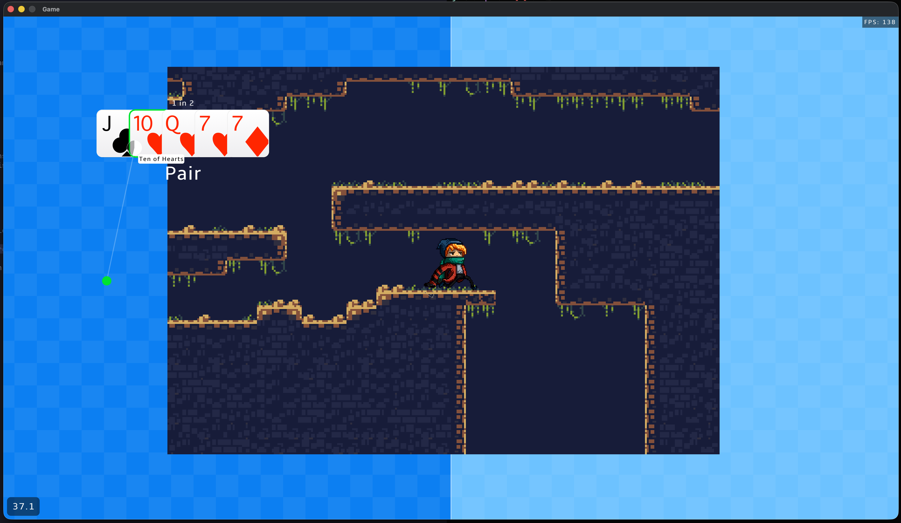

# Odin + Raylib Example

This isn't a game, it's a sandbox. I'm tire-kicking [Odin](https://odin-lang.com) and [Raylib](https://www.raylib.com/). 🥰


## Things To Learn

- [x] basic odin'ing
- [x] basic raylib'ing
- [x] tests in odin
- [x] structuring a basic game
- [x] music & sounds
- [x] pausing a game
- [x] custom fonts
- [x] timers
- [x] cursors
- [x] tweening
- [x] memory leak tracking
- [x] collision detection
- [x] sprite sheets
- [x] basic sprite animations
- [x] save/load game (json is fine)
- [x] tilemap
- [x] text input


## Screenshots




## Running

You should have `odin` [installed](https://odin-lang.org/docs/install/).

To run the app, `odin run src`

If you use [mise](https://mise.jdx.dev/), you can run `mise run r`.


## Mousities

```
left click - moves a dot
right click - shuffles (with a cooldown)
```


## Hotkeys

```
q = quit
p = pause
s = save
l = load
/ = console
```


## Struggles and Questions

* Debugging - I use print statements, which sucks in a game loop. How do real people do this?
* Allocation anxiety. Specifically around `string`s. I kinda don't want to use buffers `[256]byte` to hold them. 🤷‍♂️
* Performance anxiety. It goes fast (138-ish FPS) but I don't know how many draw calls or where the hotspots are.
* Testing ui. How do / Should I test my `draw_*` procs?
* Testing with the uses of `using` to merge in the `main` package scope.
